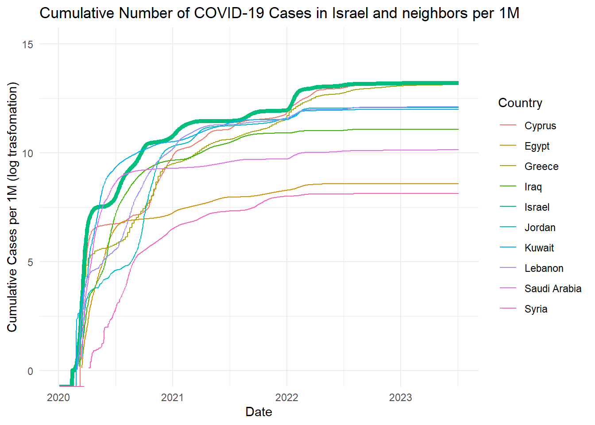
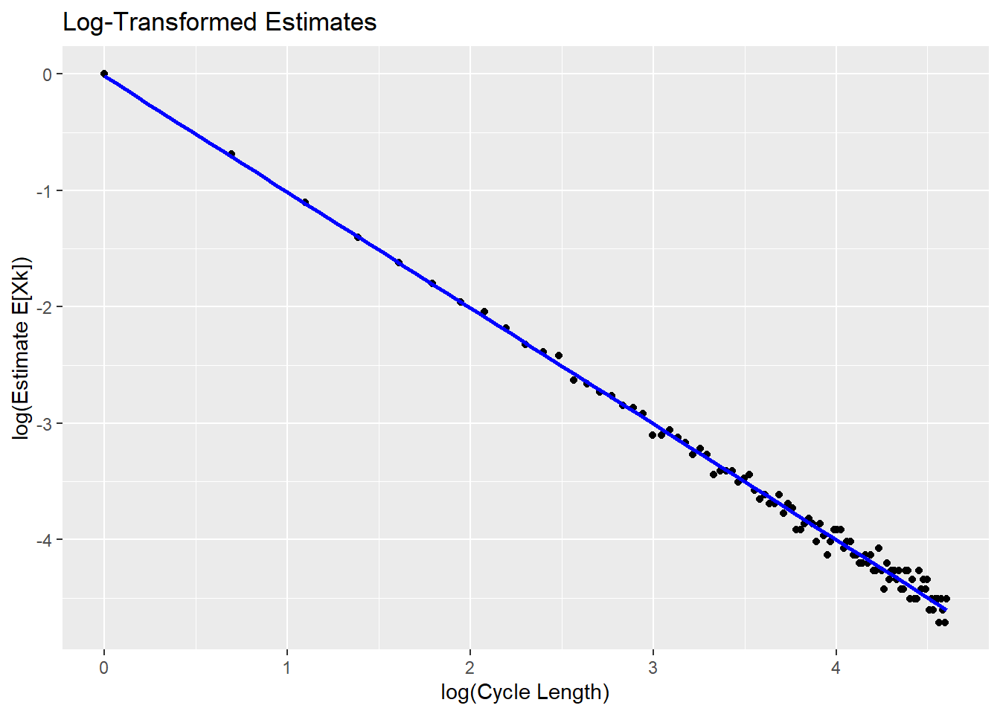
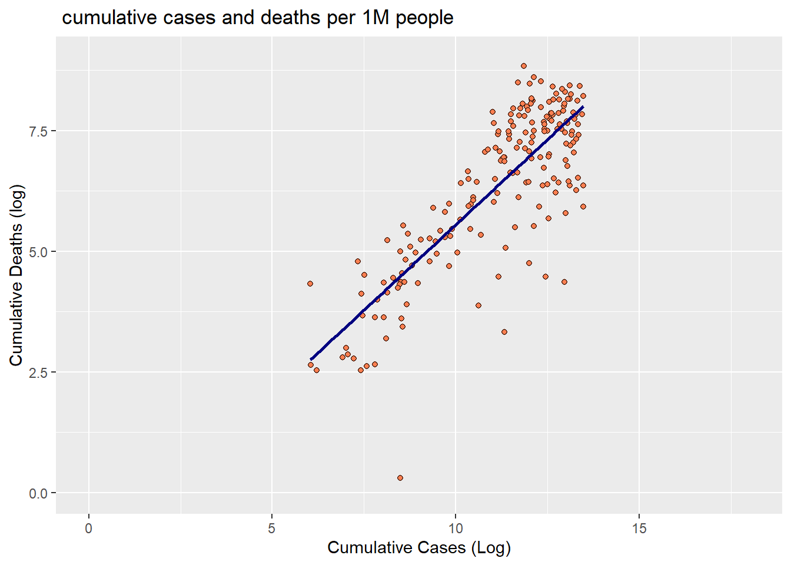
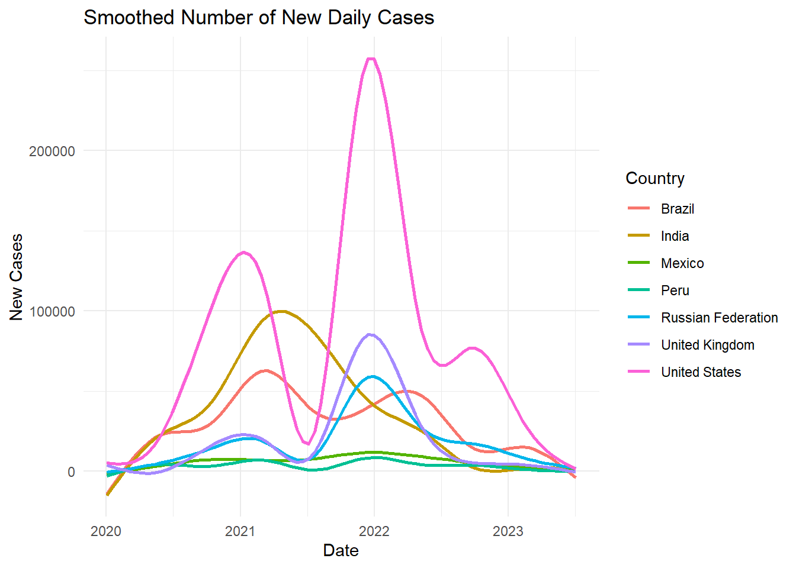

# Probability Simulations & COVID-19 Data Analysis

**Can simulation alone recover the answers to classic probability puzzles? And how did Israel's COVID-19 experience compare with its neighbours and the rest of the world?**

An R project in two parts: **Monte Carlo simulation** of classic probability puzzles, and an **analysis of the COVID-19 pandemic** using WHO's daily data for every country merged with World Bank economic indicators.

**[View the full report →](https://idoshalom1997.github.io/R-Simulations-and-COVID-Analysis/)**



## Part 1: Probability by simulation

Each puzzle is answered by simulating it 10,000-100,000 times, and the estimates land on the known theoretical answers.

| Puzzle | Simulated | Theory |
|---|---|---|
| **The confused secretary:** 100 letters go into envelopes at random. What is the chance that *no* letter reaches the right address? | 0.369 | 1/e ≈ 0.368 |
| **Cycles in a random permutation:** the expected number of cycles of length *k*, found with a log-log regression | E[X<sub>k</sub>] ≈ 0.98 · k<sup>-1.00</sup> | 1/k |
| **Same cycle:** the chance that elements 1 and 2 share a cycle | 0.491 | 1/2 |
| **13-card poker:** the chance that Alice draws a straight | 0.007 | 9/1287 ≈ 0.007 |
| ...and that Bob also draws one, *given* that Alice did (rejection sampling) | 0.047 | higher, because Alice's straight leaves Bob a smaller deck |

<p align="center"></p>

## Part 2: COVID-19 around the world

- **Israel and its neighbours.** Cases and deaths for Israel, Cyprus, Egypt, Greece, Iraq, Jordan, Kuwait, Lebanon, Saudi Arabia and Syria, both raw and per million people. Israel had one of the highest case rates in the region, but its deaths per million were moderate.
- **Deaths vs. cases.** Across all countries, deaths per million rise almost linearly with cases per million on a log-log scale. The fatality rate is strongly right-skewed (median 1%), with outliers such as Yemen (18%), Syria, Somalia, Sudan, Peru and Egypt.
- **The hardest-hit countries.** For the seven countries with more than 200,000 deaths (US, Brazil, India, Russia, UK, Mexico, Peru): when each was hit, and how many waves it had.
- **World regions.** New cases and deaths over time in each WHO region, including the Western Pacific surge in early 2023, and how GDP per capita and the share of people over 65 are distributed in each region.

| Deaths vs. cases per million (log-log) | Waves in the hardest-hit countries |
|:---:|:---:|
|  |  |

## How to run

You need R with these packages:

```r
install.packages(c("tidyverse", "maps", "rvest", "uniformly", "lubridate", "e1071",
                   "maditr", "data.table", "caTools", "rmarkdown"))
rmarkdown::render("home_exam.Rmd")
```

The data is included in [`data/`](data): the WHO COVID-19 daily data (up to July 2023) and World Bank economic indicators. The simulations use a fixed random seed, so the results are reproducible.

## Tools

R · tidyverse · ggplot2 · Monte Carlo simulation · R Markdown

## Background

Built in July 2023 by Ido Shalom during the *Data Analysis with R* course at the Hebrew University of Jerusalem (B.Sc. Statistics & Data Science).
